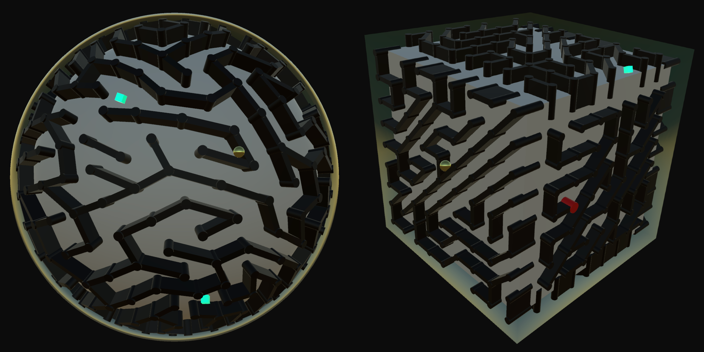

# Voll-a-Ball: Volumetric Roll-a-Ball
Creators: Jun Wang, Jaechan Lee, Chun-Cheng Chang

Voll-a-Ball reinvents [Roll-a-Ball](https://learn.unity.com/project/roll-a-ball)/[MazeGame](https://courses.cs.washington.edu/courses/cse457/24sp/project/maze-game/) by extending the ball's movement from a 2D plane to a 3D mesh. Instead of tilting the plane to guide the ball around the maze, the player navigates the ball by rotating the mesh.

Feature list:
- Predefined 3D meshes (i.e. sphere, cube) for maze generation.
- A randomly generated, solvable maze around the surface of the mesh.
- A transparent shell around the mesh to prevent the ball from rolling out of the maze.
- Three randomly generated collectibles around the surface of the mesh. When the cylinder collects one collectible, a destination is randomly determined and revealed by a red cylinder.
- The ball is generated on the top of the mesh.
- Most recent and shortest completion times are logged.
- Control
    - WASD/Arrow keys: horizontal/vertical rotation
    - Q + WASD/Arrow keys: pitch rotation
- *Note: The current system only supports playing on desktop computers.*

[Demo video](https://youtu.be/kayTFWyx_6s)